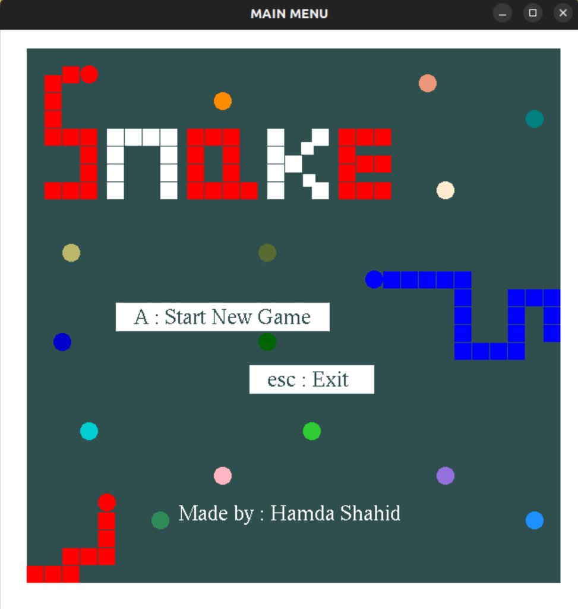
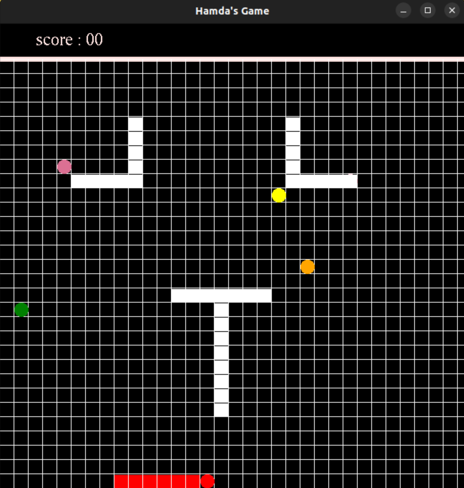
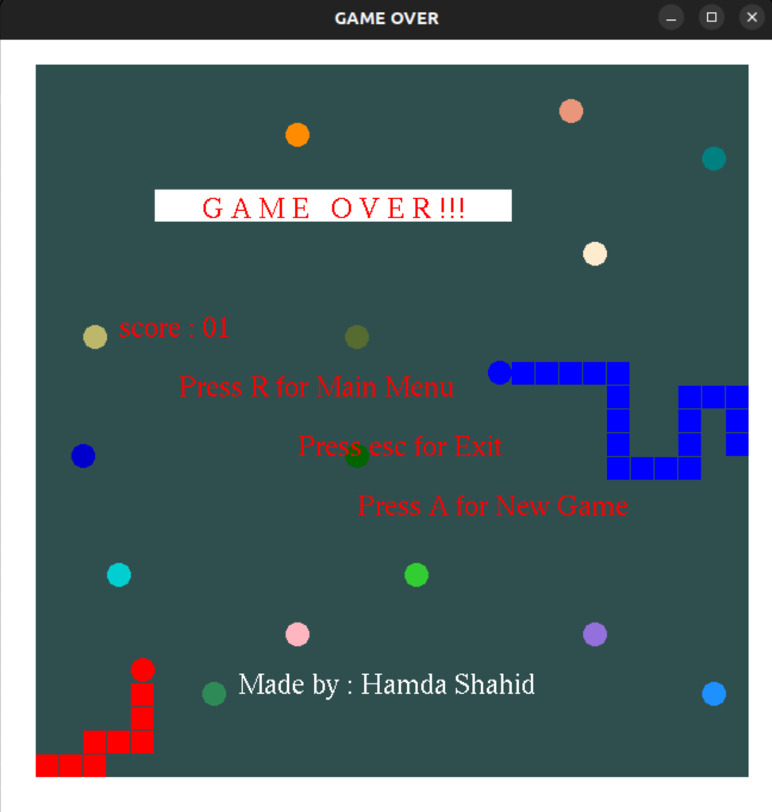

# Snake Game in C++

Welcome to the Snake Game project! This is a classic Snake game implemented in C++ using procedural programming concepts. Enjoy the nostalgia of the retro Snake game with modern enhancements.

## Table of Contents

- [Introduction](#introduction)
- [Features](#features)
- [Installation](#installation)
- [How to Play](#how-to-play)
- [Screenshots](#screenshots)
- [Screencasts](#screencasts)
- [Contributing](#contributing)
- [License](#license)

## Introduction

The Snake Game is a simple game where the player maneuvers a snake to eat food, growing in size with each meal. The game ends if the snake collides with itself or the walls.

## Features

- Classic Snake gameplay
- Simple and intuitive controls
- Increasing difficulty with snake growth
- Score tracking

## Installation

To run the Snake Game on your local machine, follow these steps:

1. Clone the repository:
   ```sh
   git clone https://github.com/hamdashahid/SnakeGame.git
   ```
2. Navigate to the project directory:
   ```sh
   cd SnakeGame
   ```
3. Build the game using `make`:
   ```sh
   make
   ```
4. Run the game:
   ```sh
   ./snakegame
   ```

## How to Play

- Use the arrow keys to control the direction of the snake.
- Eat the food to grow longer.
- Avoid colliding with the walls or the snake's own body.
- Try to achieve the highest score possible!

## Screenshots


_Game Start Screen_


_Gameplay Screenshot_


_Game Over Screen_

## Screencasts

Watch the game in action:

[]

## Contributing

Contributions are welcome! Please fork the repository and submit a pull request with your improvements.

## License

This project is licensed under the MIT License. See the [LICENSE](LICENSE) file for details.

Enjoy the game and happy coding!
